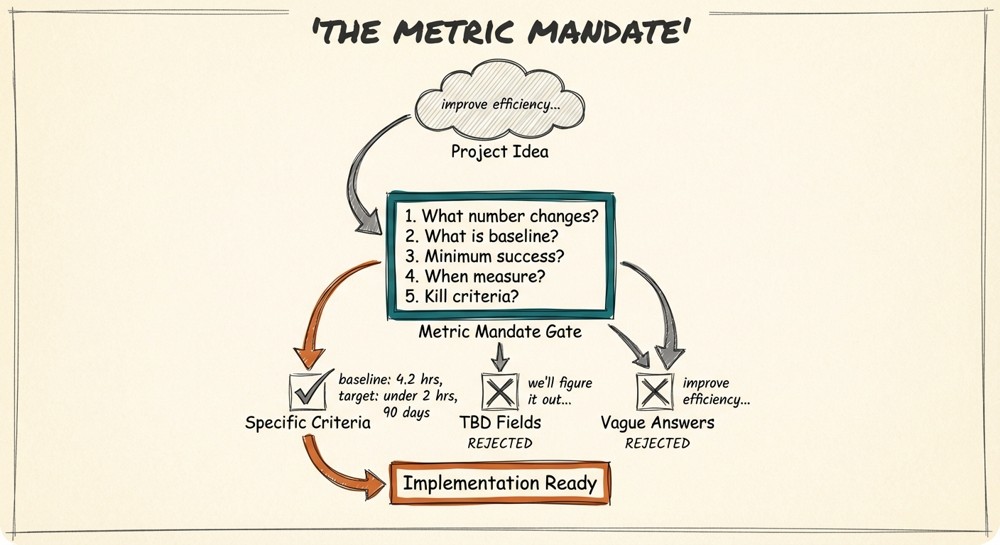

# The Metric Mandate - Claude Skill

[](https://opensource.org/licenses/MIT)
[](https://claude.ai)



A copy-paste Claude prompt that forces you to define measurable success criteria for AI projects before you start building.

## What This Does

Before any AI project moves past the idea stage, you need to answer 5 critical questions:

1. **What specific number will change?**
2. **What is that number today?** (baseline)
3. **What's the minimum improvement that justifies the investment?**
4. **When will you measure?**
5. **What result means you stop?** (kill criteria)

This Claude skill guides you through all 5 questions and **rejects vague answers** until you have specific, measurable criteria.

## Why This Matters

Projects without clear metrics can't fail. There's no definition of failure. So they drift indefinitely, consuming budget while delivering "learnings" instead of results.

Six months later, someone asks "Did the AI project work?" and the honest answer is "We don't know, because we never defined what 'working' meant."

The Metric Mandate prevents that.

## Installation

### Option 1: Claude Code
```bash
# Copy the prompt
cat metric-mandate-prompt.txt | pbcopy

# Create a new Claude Code session and paste
```

### Option 2: Claude.ai
1. Copy the contents of `metric-mandate-prompt.txt`
2. Create a new Project in Claude.ai
3. Add the prompt to "Custom Instructions"
4. Start a conversation describing your AI project

### Option 3: Quick Use
Just copy the prompt and paste it into any Claude conversation.

## Usage

1. Start a conversation with Claude using this prompt
2. Describe your AI project idea
3. Answer each of the 5 questions as Claude guides you
4. Claude will reject vague responses and push for specifics
5. When complete, you'll get a summary table with all criteria

## Example Transformation

**Before (vague):**
"We want to use AI to improve our customer service."

**After (specific):**
"We want to reduce average ticket resolution time from 4.2 hours to under 2 hours within 90 days. If we're not below 3 hours by day 60, we'll reassess the approach. Current baseline measured from Q4 2024 data across 12,000 tickets."

## What Makes This Different

Most AI project planning tools accept vague goals. This one doesn't. It's deliberately rigid because:

- Projects without clear metrics can't fail (which means they can't succeed either)
- Vague goals lead to "sort of done" results
- If you can't answer these 5 questions with specific numbers, you're not ready to build

The discomfort you feel defining kill criteria? That's the point. If you won't commit to when you'd stop, you probably shouldn't start.

## Files

- `metric-mandate-prompt.txt` - The complete Claude skill prompt (copy this)
- `README.md` - This file
- `LICENSE` - MIT License
- `examples/` - Sample conversations and outputs

## Related Tools

- **ChatGPT version**: [metric-mandate-chatgpt](https://github.com/aplaceforallmystuff/metric-mandate-chatgpt) - Same framework for ChatGPT users

## Origin Story

This framework comes from the Signal Over Noise newsletter article: [*"The Metric Mandate: Why 'Improve Efficiency' Isn't a Goal"*](https://signalovernoise.at)

Written by Jim Christian, an AI consultant and strategist based in Valencia, Spain.

## Contributing

Found a way to improve the prompt? Open a PR or issue.

## License

MIT License - See LICENSE file for details.

Free to use, share, and adapt with attribution.

## Author

**Jim Christian**
- Newsletter: [Signal Over Noise](https://signalovernoise.at)
- Website: [jimchristian.net](https://jimchristian.net)
- Open Source: [signalovernoise.at/open-source](https://signalovernoise.at/open-source)

---

*Part of the Signal Over Noise open-source collection - practical tools for AI implementation without the hype.*
